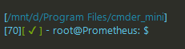
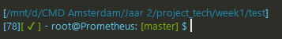
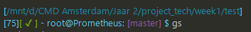
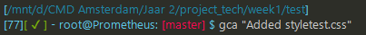

# Folkert's Dotfiles
My bash settings.

## Installation
Download the files and place them in your root directory (~/.filename)  
Or take the parts of the code you need and put them in your own .bash_profile or .bashrc.

If you decide to use my aliases **and** my profile, put both files in the same folder (`~/.bash_profile` & `~/.bash_aliases`)

(you can get in the ~ directory by typing `cd ~` in your terminal)

## What does it do?
### The .bash_profile
Basically, it changes your prompt.



```
[/mnt/d/Program Files/cmder_mini]
```
The above shown part of the prompt shows the current working directory
</br>
</br>

```
[70]
```
The amount of commands you executed in your current session
</br>
</br>

```
[ ✔ ]
```
Shows wether the latest command you executed was a good or bad command
</br>
</br>

```
- root@Prometeus: $
```
Shows the user@host
</br>
</br>

When you are inside a directory that is also a git repository, the prompt wil show some information about said directory:


If you have made new files that are currently untracked, the git info prompt part will turn purple:


If you have tracked files, which were updated, that haven't been commited yet the git info prompt part will turn red:


</br>
</br>
### The .bash_aliases
The .bash_aliases file adds some new commands for your terminal, mainly shorthand versions of existing commands.

#### Git shorthands
I made some shorthand versions for certain git commands, the shorthands are `gi`, `gs`, `gp`, `gc` and `gca`.

```
gi
```
Inits a git repository (short for `git init`)
</br>
</br>

```
gs
```
Shows the status of a git repository (short for `git status`)
</br>
</br>

```
gp
```
Will push current commits to origin master (short for `git push`)
</br>
</br>

```
gc "Your commit message goes here"
```
Will commit currently added files and add a message. Accepts a parameter which will be your commit message. (short for `git commit -m "commit message"`)
</br>
</br>

```
gca "Your commit message goes here"
```
Will add all currently untracked/updated files and then commit all files currently staged for commit. Accepts a parameter which will be your commit message. (short for `git add --all; git commit -m "commit message"`)
</br>
</br>


#### Make new directory and go inside newly made directory
```
mkcdir "new_directory_name"
```
Makes a new directory and moves your current working directory to this directory
</br>
</br>


#### List all
```
la
```
Prints a list of all files in the current working directory: including hidden ones. Shorthand for `ls -a`
